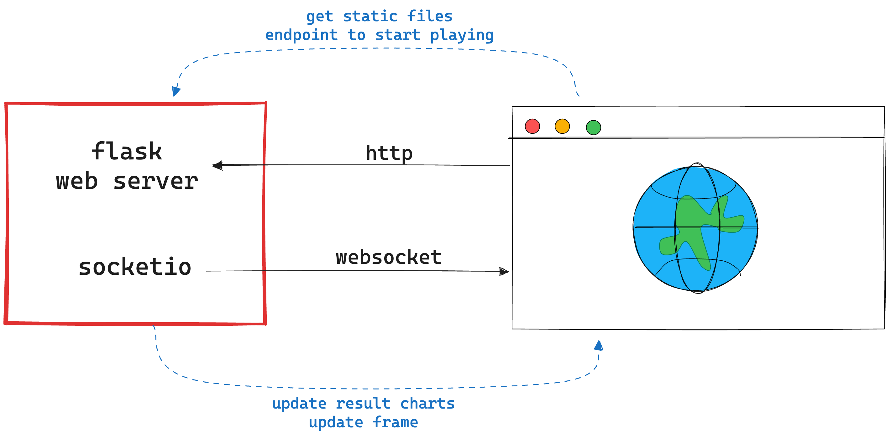

# stealth gesture clash 🥷🏻 🪨 📃 ✂️

A simple Flask game with SocketIO using [roboflow's rock paper scissor model](https://universe.roboflow.com/roboflow-58fyf/rock-paper-scissors-sxsw).

## the game 🎮

Play rock, paper, scissors against a computer bot for 10s through video stream. Whoever wins the most rounds in 10s wins!

## system overview 💻



It's a Flask with Flask SocketIO server that serves the game and handles the game logic.
Static files are served by Flask and the game is rendered on the client side using vanilla HTML, CSS, and JavaScript. Styling is done using Bootstrap and TailwindCSS. The database is a simple json file 👌🏻

The server runs an [inference](https://github.com/roboflow/inference) pipeline to get video stream data from your device's camera to evaluate your hand gesture and [supervision](https://github.com/roboflow/supervision) to draw the predictions on the video stream.

Whenever a new prediction comes from the pipeline, the server sends the frame and the game result to the client using SocketIO, and the client updates the video stream and the reuslt chart.

## loom video 📹

[

## run 🧑‍💻

You will need to use a Python>=3.8,<=3.11 environment.

```bash
export ROBOFLOW_API_KEY=<your_roboflow_api_key>

pip install -r requirements.txt

python app.py
```

It will start your game at http://localhost:8080 🎉

## next steps 🚀

- [ ] Multiplayer mode